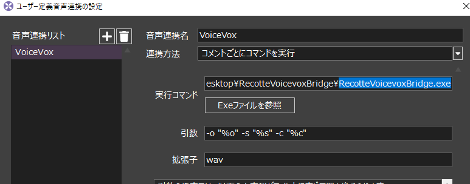
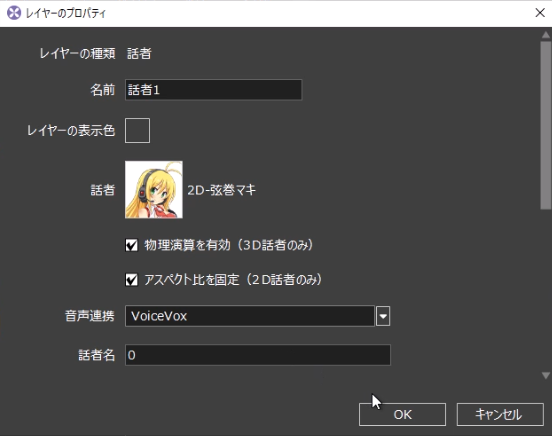

# RecotteVoicevoxBridge

RecotteStudioとVOICEVOXを連携させるアプリです。

## 使い方

1. [RecotteStudio](https://www.ah-soft.com/rs/updates/)と[VOICEVOX](https://voicevox.hiroshiba.jp/)の最新版をそれぞれインストールしてください。
1. [Releases](https://github.com/wallstudio/RecotteVoicevoxBridge/releases)からRecotteVoicevoxBridgeをダウンロードして適当なディレクトリに展開します。
1. RecotteStudioの外部アプリ連携を画像のように設定します。（実行コマンドのexeファイルの場所は各環境に合わせてください）
1. VOICEVOXを起動してください。
1. RecotteStudioの話者を先ほど設定した設定にしてください。（話者名は 0=ずんだもん, 1=四国めたん です）
1. CeVIOAPI連携と同様に更新をかけるたびに自動でVOICEVOXから音声データを引っ張って来るようになります。




RecotteStudioの設定方法は以下の動画がわかりやすいので見てください。（あとマキさんが可愛いので）  

https://twitter.com/ahsoft/status/1423217051456262149?s=20


## 仕組み

VoiceVox起動状態でVoiceVoxEngineが起動している筈なので、横からHTTPリクエストを飛ばす。


```
RecotteStudio
↓ shell ( -o "%o" -s "%s" -c "%c" )
RecotteVoicevoxBridge
↓ http api (http://127.0.0.1:50021/audio_query, http://127.0.0.1:50021/synthesis)
VoiceVoxEngine
↓ PCM
RecotteVoicevoxBridge
↓ Wav file
RecotteStudio
```

## Build

```
npm install
.\build.bat
```
